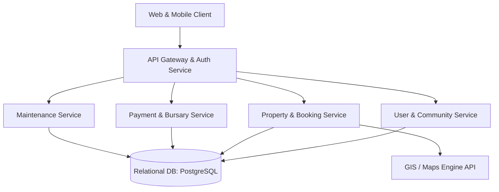

# Accofinder: Technical Architecture & Data Models

This document details the system design, relational database schemas, and architectural patterns of Accofinder.

---

## 1. High-Level System Architecture

Accofinder follows a modern microservices or modular monolith pattern, segregating services by domain concerns:



* **Database:** PostgreSQL with **PostGIS** extension for geo-spatial queries (e.g., matching coordinates of student accommodation to campus coordinates).
* **Real-time Messaging:** WebSockets or server-sent events (SSE) for in-app tenant chat and live status tracking alerts.

---

## 2. Relational Database Schema

Below is the design of the core database tables representing our data-driven model.

### 2.1 Users Table (`users`)
Tracks credentials and profile types for all platform participants.

| Column | Type | Constraints | Description |
| :--- | :--- | :--- | :--- |
| `id` | UUID | PRIMARY KEY | Unique user identifier |
| `email` | VARCHAR(255) | UNIQUE, NOT NULL | Login credential |
| `password_hash` | VARCHAR(255) | NOT NULL | Hashed password |
| `role` | VARCHAR(50) | NOT NULL | `tenant`, `landlord`, `manager`, `provider`, `bursary`, `admin` |
| `full_name` | VARCHAR(255) | NOT NULL | User's full name |
| `phone_number` | VARCHAR(50) | | Contact details |
| `is_verified` | BOOLEAN | DEFAULT FALSE | Verified state (essential for anti-scam) |
| `created_at` | TIMESTAMP | DEFAULT CURRENT_TIMESTAMP | Date account was registered |

### 2.2 Properties Table (`properties`)
Stores accommodation details, geographical coordinates, and pricing.

| Column | Type | Constraints | Description |
| :--- | :--- | :--- | :--- |
| `id` | UUID | PRIMARY KEY | Unique property identifier |
| `landlord_id` | UUID | REFERENCES `users(id)` | Property owner |
| `title` | VARCHAR(255) | NOT NULL | E.g. "Greenway Student Residence" |
| `description` | TEXT | | Details about the property |
| `address` | TEXT | NOT NULL | Readable address |
| `latitude` | NUMERIC(10, 8) | NOT NULL | Geo coordinate |
| `longitude` | NUMERIC(11, 8) | NOT NULL | Geo coordinate |
| `geom` | GEOMETRY(Point, 4326) | | PostGIS geometry column for fast spatial indexing |
| `monthly_rent` | DECIMAL(12, 2) | NOT NULL | Cost per month |
| `amenities` | JSONB | | E.g. `{"wifi": true, "gym": false, "laundry": true}` |
| `status` | VARCHAR(50) | DEFAULT 'available' | `available`, `fully_booked`, `under_maintenance` |

### 2.3 Applications Table (`applications`)
Tracks a tenant's request to occupy a unit or room.

| Column | Type | Constraints | Description |
| :--- | :--- | :--- | :--- |
| `id` | UUID | PRIMARY KEY | Unique application identifier |
| `tenant_id` | UUID | REFERENCES `users(id)` | Applicant student |
| `property_id` | UUID | REFERENCES `properties(id)` | Requested property |
| `funding_source` | VARCHAR(100) | NOT NULL | `self_funded`, `bursary_sponsor` |
| `bursary_id` | UUID | REFERENCES `users(id)` NULL | Funder user account link if sponsored |
| `status` | VARCHAR(50) | DEFAULT 'pending' | `pending`, `screening`, `approved`, `rejected` |
| `applied_at` | TIMESTAMP | DEFAULT CURRENT_TIMESTAMP | Application time |

### 2.4 Leases Table (`leases`)
Represents the signed agreement binding the landlord and tenant.

| Column | Type | Constraints | Description |
| :--- | :--- | :--- | :--- |
| `id` | UUID | PRIMARY KEY | Unique lease identifier |
| `application_id` | UUID | REFERENCES `applications(id)` | Source application |
| `tenant_id` | UUID | REFERENCES `users(id)` | Tenant |
| `property_id` | UUID | REFERENCES `properties(id)` | Property |
| `start_date` | DATE | NOT NULL | Lease start date |
| `end_date` | DATE | NOT NULL | Lease end date |
| `monthly_rent` | DECIMAL(12, 2) | NOT NULL | Lock-in price |
| `lease_agreement_url` | TEXT | | Link to signed PDF/document |
| `signed_by_tenant` | BOOLEAN | DEFAULT FALSE | Digital sign marker |
| `signed_by_landlord`| BOOLEAN | DEFAULT FALSE | Digital sign marker |
| `status` | VARCHAR(50) | DEFAULT 'inactive' | `inactive`, `active`, `terminated`, `expired` |

### 2.5 Chat Rooms & Messages (`chat_rooms`, `messages`)
Facilitates the social network aspect and tenant communication.

```sql
CREATE TABLE chat_rooms (
    id UUID PRIMARY KEY,
    property_id UUID REFERENCES properties(id) ON DELETE SET NULL, -- Unit or building room
    name VARCHAR(255) NOT NULL,
    type VARCHAR(50) NOT NULL -- 'direct', 'roommate_group', 'building_announcement'
);

CREATE TABLE messages (
    id UUID PRIMARY KEY,
    room_id UUID REFERENCES chat_rooms(id) ON DELETE CASCADE,
    sender_id UUID REFERENCES users(id) ON DELETE SET NULL,
    content TEXT NOT NULL,
    sent_at TIMESTAMP DEFAULT CURRENT_TIMESTAMP
);
```

### 2.6 Maintenance Tickets Table (`maintenance_tickets`)
Handles coordination between tenants, landlords, and service providers.

| Column | Type | Constraints | Description |
| :--- | :--- | :--- | :--- |
| `id` | UUID | PRIMARY KEY | Unique ticket identifier |
| `property_id` | UUID | REFERENCES `properties(id)` | Where the issue is located |
| `reported_by` | UUID | REFERENCES `users(id)` | Tenant who created the issue |
| `service_provider_id`| UUID | REFERENCES `users(id)` NULL | Hired professional |
| `title` | VARCHAR(255) | NOT NULL | E.g. "Burst water pipe in bathroom" |
| `description` | TEXT | NOT NULL | Detailed breakdown |
| `media_urls` | TEXT[] | | Array of photo/video links of the damage |
| `status` | VARCHAR(50) | DEFAULT 'reported' | `reported`, `assigned`, `in_progress`, `resolved` |
| `created_at` | TIMESTAMP | DEFAULT CURRENT_TIMESTAMP | Submission timestamp |
| `resolved_at` | TIMESTAMP | | Completion timestamp |

---

## 3. Geographical & Data-Driven Capabilities

Because students seek proximity to campus, we leverage geography functions. Using PostGIS queries, we can locate student housing efficiently.

### Example Proximity Query
To find verified student accommodations within **2 kilometers** of a university campus coordinate (e.g., `-33.958, 18.460`):

```sql
SELECT title, address, monthly_rent,
       ST_Distance(geom, ST_MakePoint(18.460, -33.958)::geography) AS distance_meters
FROM properties
WHERE ST_DWithin(geom, ST_MakePoint(18.460, -33.958)::geography, 2000)
  AND status = 'available'
ORDER BY distance_meters ASC;
```
This spatial capability enables students to make highly analytical, geographic decisions when choosing accommodations.
