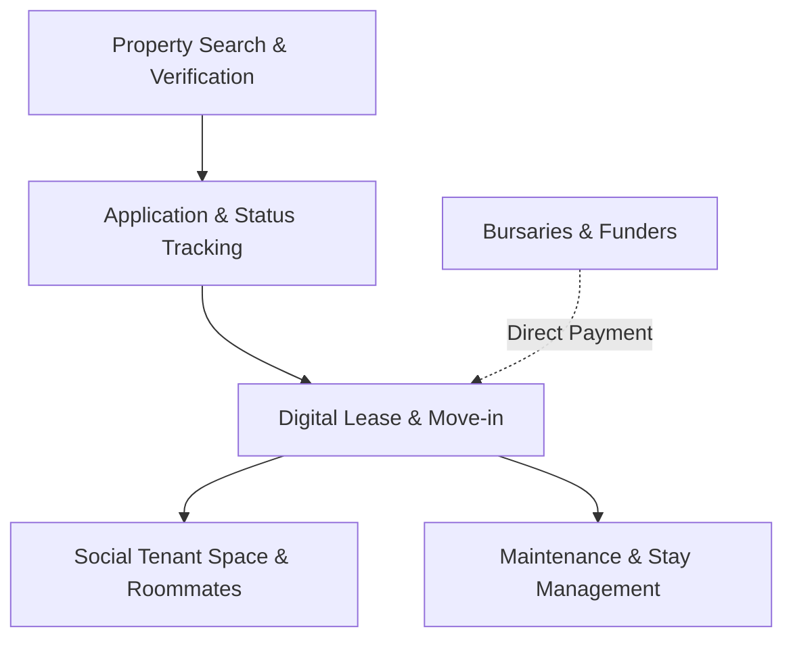

# Accofinder: Product Vision & System Concept

Accofinder is a next-generation, data-driven accommodation platform tailored specifically for students. It bridges the gap between secure property rentals (Airbnb style) and student communities (Social Network style).

---

## 1. Problem Statement & Mission

### The Core Problem
Students face immense friction when searching for off-campus housing:
* **Untrusted Channels:** Relying on Facebook Groups, WhatsApp chats, and offline bulletin boards makes students prime targets for deposit scams and identity theft.
* **Lack of Transparency:** High-quality details (accurate location, true condition, roommate profiles, and utility inclusion) are rarely available in one consolidated place.
* **Fragmented Experience:** Applications, lease signings, rent payments, maintenance requests, and talking to prospective roommates are split across multiple disjointed apps.

### The Accofinder Mission
To create a safe, consolidated, data-driven ecosystem that empowers students to:
1. Find verified properties using robust geographical metadata.
2. Direct-apply and track lease application statuses transparently.
3. Collaborate, chat, and vet potential co-tenants before moving in.
4. Execute digital lease agreements and coordinate maintenance seamlessly.

---

## 2. Core Strategic Pillars

### The Core Insight: Trust Infrastructure
Accofinder is not just a listing site; it is a **trust infrastructure**. Every interaction—from the initial search query to final move-out—leaves a secure data trail that protects both tenants and landlords, generating data that makes the platform smarter over time.

### The Three Engines
1. **Verified Identity Layer:** Landlords undergo property verification, and tenants undergo student verification (via academic email domain check or enrollment certificate uploads). This mechanism eliminates the majority of listing and deposit scams prevalent on WhatsApp and Facebook.
2. **Data-Driven Matching Engine:** Fuses location (distance to campus, transport routes), budget constraint parameters, lifestyle preferences (study hours, cleanliness), and historic reviews. As usage increases, recommendations continuously optimize.
3. **The Trust Graph:** Mutual reviews build social accountability. Tenants rate landlords on responsiveness and property upkeep; landlords rate tenants on cleanliness and payment history. Landlords who neglect maintenance or tenants who damage property see their ratings dynamically degrade.

---

## 3. Implementation Roadmap (Prioritization)

We prioritize building the core loop first to capture value, then expand:

```
[Phase 1: Discovery & Listings] ──> [Phase 2: Application & Leasing] ──> [Phase 3: Stay Management] ──> [Phase 4: Social & Bursaries]
      (The Acquisition Hook)                (The Transaction Engine)               (The Retention Loop)            (The Scaling Multiplier)
```

1. **Discovery + Listings (Acquisition Hook):** Launch interactive map search, listing uploads, and verified badge checks to attract users.
2. **Application + Leasing (Transaction Engine):** Build the application submission funnel, status pipeline tracking, and digital lease signing.
3. **Stay Management (Retention Loop):** Implement tenant maintenance ticket submission, service provider routing, and rent invoice tracking.
4. **Social Community & Bursaries (Scale & Integration):** Introduce group chats, roommate matchmaking feeds, and bursary funding APIs once the core transaction loop is validated.

---

## 4. Strategic Questions & Design Decisions

To make the system fully successful, we must collaborate on three pivotal questions:

> [!IMPORTANT]
> **1. Primary Geography:** Are we launching in a single city/country first, or multi-region from day one?
> * *Impact:* Verification systems (different academic registries), currency systems, lease regulations, and address validation engines vary significantly across borders.

> [!IMPORTANT]
> **2. Monetization Model:** How should we structure revenue generation?
> * *Options:* Landlord subscriptions, commission per signed lease transaction, premium features (such as priority listings), or sponsor/bursary partnership fees.

> [!IMPORTANT]
> **3. Platform Strategy:** Should we target a mobile-first Progressive Web App (PWA) or build native mobile apps alongside the web portal?
> * *Impact:* Affects real-time messaging latency, offline document signing support, push notification reliability for maintenance tickets, and development speed.

---

## 5. Platform User Roles (Actors)

Accofinder serves a multi-tenant ecosystem containing five primary actors:

| Role | Core Description & Capabilities |
| :--- | :--- |
| **Tenant (Student)** | Searches properties, views detailed geodata, submits applications, tracks application status, signs digital leases, submits maintenance issues, and interacts with other tenants in a social space. |
| **Landlord (Property Owner)** | Lists properties, reviews applications, signs lease agreements, manages rent/payments, tracks maintenance tickets, and interacts with tenants. |
| **Accommodation Manager** | Hired by landlords to handle day-to-day operations, screen tenants, verify properties, and assign maintenance tickets. |
| **Service Provider** | Plumbers, electricians, cleaners, and other local professionals who accept maintenance contracts submitted through the platform. |
| **Bursary / Corporate Sponsor** | External funding bodies (e.g., government aid, scholarships, corporate sponsors) that verify student status and pay rent directly to landlords. |
| **Admin (Platform Operator)** | Verifies landlords and properties, manages system audits, resolves disputes, and monitors platform health. |

---

## 6. The Core Experience: Social Network Meets Airbnb

Accofinder uniquely fuses structural booking tools with social interactions.



### A. Airbnb Features (Booking & Accommodation Management)
* **Map-Centric Search:** Filter properties by precise radius to campuses, public transport, grocery stores, and crime safety indices.
* **Lease Tracking Pipeline:** Transparent application states: `Draft` $\rightarrow$ `Submitted` $\rightarrow$ `Screening` $\rightarrow$ `Approved` $\rightarrow$ `Lease Signed` $\rightarrow$ `Active Tenant`.
* **Landlord Portal:** Dynamic metrics on occupancy rates, rent collection progress, and open maintenance requests.

### B. Social Network Features (Facebook/Community Derivative)
* **Co-Tenant Messaging:** Group chats created dynamically for each building or apartment unit, allowing tenants to coordinate chores, bills, or social activities.
* **Roommate Finder:** Opt-in profiles matching students based on clean habits, study hours, hobbies, and budget.
* **Building Feeds:** An active feed where landlords and building managers can post announcements (e.g., scheduled electricity outages, social events) and tenants can interact or ask questions.

---

## 7. Key Workflows

### 1. Application & Stay Lifecycle
1. **Explore:** Students filter verified listings based on proximity parameters.
2. **Apply:** Students upload identity documentation, proof of funding (bursary status or guarantor details), and submit.
3. **Screen:** Landlords/Managers review student credentials and run checks.
4. **Sign:** The system generates a digital lease agreement signed by both parties using legally binding digital signatures.
5. **Onboard:** The student is added to the building's social feed and unit group chat automatically.

### 2. Maintenance Management Flow
* **Report:** A tenant takes a photo/video of a broken appliance or leakage, writes a description, and submits a maintenance ticket.
* **Assign:** The landlord reviews and assigns the ticket to a registered **Service Provider**.
* **Resolve:** The service provider fixes the issue, uploads photo proof of repair, and the tenant marks the ticket as resolved.

### 3. Scam Prevention & Trust Architecture
* **Verified Landlord & Property Badge:** Admin verification of ownership deeds or business licenses before a listing goes public.
* **Escrow/Platform-Guided Deposits:** Security deposits are held in a secure trust accounts until the lease starts, shielding students from phantom listing scams.
* **In-App Messaging:** Restricting early contact to inside the platform to flag suspicious patterns (such as off-platform payment solicitations).
